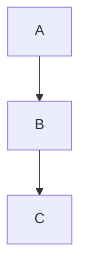

# Style Rules — Output Polish

Applies to any deliverable reaching team, manager, stakeholder, or external audience. Hiring submissions = STRICTEST.

## Language Convention

| Document type | Language |
|---------------|----------|
| Claude context / training docs (CLAUDE.md, README, skills, commands, hooks, planning) | **Full English** |
| Stakeholder reports (business reports, presentations, emails to team / managers) | **Stakeholder's primary language with proper diacritics** (e.g., full Vietnamese with `ệ` / `ỉ` / `ổ`) |
| Code comments / identifiers | English |
| Mixed conversational replies to user | User's preferred mix (e.g., Vietnamese + English with technical terms in English) |

Rules:
- Stakeholder-facing output MUST use the stakeholder's primary language with full orthographic correctness — never strip diacritics ("loc" instead of "lộc" looks unprofessional)
- Technical terms (API, endpoint, deploy, pipeline, query, mart, dry-run) stay in English in ANY language
- For Vietnamese specifically: all diacritics required — `ệ`, `ỉ`, `ổ`, `à`, `ă`

## AI-Tell Symbol Ban (hiring + professional deliverables)

Forbidden in stakeholder text and hiring submissions:
- `===` headers (markdown convention but reads as AI artefact in prose)
- `-----` separators
- Em-dash overuse (`—`) — use comma or period
- `≈` (approximation symbol) — write "khoảng" or "around"
- `→` in stakeholder body text (use "leads to" / "dẫn đến")
- Perfect 14-section symmetric structure
- Every-metric-explained marketing-README tone
- Comment over every line of code (zero-comment + over-note are BOTH anti)

What IS allowed:
- Markdown headings `#`, `##`, `###`
- Inline code backticks ``
- Bullet lists
- Tables for comparison
- `→` inside CODE blocks for flow arrows (it's syntactic there)

## Human Author Voice — Hiring Deliverables

Hiring case deliverables MUST look human-authored. Drop AI tells:
- No 14-section pre-template
- Lean prose, NOT marketing tone
- Mixed VN-EN natural code-switching acceptable
- Casual phrasing acceptable for working notes
- Free-form notes thay vì 14-section
- Bring "I assumed because brief did not give X" — surface assumptions explicitly

### Candidate voice (no meta-framing)
- Speak first-person: "I built", "I designed", "I assumed"
- Ban meta-narrator framing: "The candidate built", "This submission demonstrates"
- Ban imported frameworks without justification (no "Using STAR method..." filler)
- DO NOT conflate brief facts with candidate inference — mark inferences as "I assumed because brief did not give X"

### No fabricated credentials
- NEVER invent academic credentials for the user (BSc / MSc / PhD / certifications) without verification
- Default bio: job title + company + years experience; NO academic credentials unless explicitly listed in user's actual CV
- Past incident pattern: inserting unverified "BSc & MSc Statistics" caught moments before public lecture — do not repeat

### Exotic options ban
- DA hiring deliverable: NEVER list advanced platform options Loc cannot defend (HF Spaces, Render, Railway, K8s, EKS)
- Use 1 chosen tool + 1-sentence why
- Reject laundry lists of alternatives

## Plain Language — Teaching / Training

Teaching slides MUST use plain-language WRONG vs RIGHT framing, NOT formula / symbol dumps.

WRONG slide: `E[AUM] = 12.96T. z = −2.19. %gap = −6.5%` (zero interpretation)

RIGHT slide:
- Plain: "AUM thực tế thấp hơn dự kiến 6.5% (~840B VND) — vượt ngưỡng cảnh báo (±5%)"
- Then formula in small print: `z = −2.19 < −1.96 → significant`

Reference for the WRONG-vs-RIGHT pattern: `output/projects/business_stats_econometrics_training.html` slides 12-16.

## Label Glue Implies Causation — BAN

Never glue calendar / context label after a numerical breakdown.

WRONG: "X = 0.98 · Ngày 5 payday" — reads as causation. Stakeholder distrust scales fast.

RIGHT: "X = 0.98. Day 5 happens to be payday in this calendar — see Reasoning section for whether payday actually drives the coefficient."

Causation requires the 5-stage chain (Fact → Mechanism → Behavior → Impact → Evidence). A label is NOT a chain.

## Number Formatting

### Units
- `< 1M` → K (e.g., 850K)
- `< 1B` → M (e.g., 12.5M)
- `< 1000B` → B (e.g., 572B)
- `≥ 1000B` → T (e.g., 12.96T)

### Decimals
- Default: 2 decimals (12.96T, 5.50%)
- Dense tables: 1 decimal (123.4B)
- People counts: NO decimal, comma separator (1,234,567 users)

### Spacing
- Summary text: space before unit (`1.97 T`, `13.2 %`)
- Dense tables: no space (`123.4B`, `13.2%`)

### Sentiment colors (charts + tables) — WITH CONTEXT OVERRIDE

Defaults (AUM-growth / wallet-health context):
- Cashout ↑ = RED
- Cashin / Net / AUM ↑ = GREEN
- Churn ↑ = RED
- Revenue ↑ = GREEN
- Cost ↑ = RED

**Context override (MANDATORY)**: Default colors are AUM-context. Other contexts flip them.

| Context | "Cashout ↑" should be | Why |
|---------|------------------------|-----|
| AUM growth dashboard | RED (cashout reduces AUM) | Decreases the headline metric |
| Liquidity / wallet-health dashboard | GREEN (cashout proves liquidity) | Confirms wallet is usable |
| Fraud-monitoring dashboard | RED only IF rate > baseline | Cashout itself isn't bad; rate spike is |

Rule: document the override mapping in the report header (one paragraph) OR in the project config. NEVER ship color without context — readers infer wrong verdict.

### Dual-Comparison Mandate (KPI cards / headline metrics)

Every KPI shown in a stakeholder report MUST display TWO comparisons, not one:

- **DoD** — day-over-day delta (vs yesterday)
- **vs 7-day average** — current day vs 7-day-rolling baseline

Single-delta KPIs ("GMV +5%") are noise without context — a +5% Monday is normal seasonality, not signal. Dual comparison lets the reader distinguish trend from cycle at a glance.

Format:
```
GMV
120 tỷ
▲ DoD +5%
▲ vs 7d avg +8%
```

For metrics where DoD is meaningless (weekly aggregates, monthly KPIs), substitute the relevant pair (WoW + vs 4w avg, or MoM + vs same-month-last-year).

### Chart Anatomy — 7 Mandatory Elements

Every chart shipped to stakeholders MUST have ALL 7 elements. Charts missing any element are NOT finished.

| # | Element | Why mandatory |
|---|---------|---------------|
| 1 | **Figure N + descriptive title** | Cross-reference from prose; reader knows what chart is about |
| 2 | **Labeled axes (with units)** | Prevents misreading scale / values |
| 3 | **Legend** (if 2+ series) | Reader knows which line is which |
| 4 | **Total / summary cards** above or beside | One-glance headline before reading the chart |
| 5 | **Insight line** below ("→ takeaway: candidate / strong / drop") | The verdict the chart proves |
| 6 | **Notes** (source, sample size, time window, exclusions) | Audit trail + interpretation caveats |
| 7 | **Download PNG button** (HTML reports) | Stakeholder workflow: save chart for slide deck / email |

Half-finished charts (no insight line, no notes, no axis units) FAIL the chart-anatomy check.

### Metric denominator — MANDATORY
Every metric in stakeholder report MUST show: **absolute + % + total**.

WRONG: "76% sessions tốt" (empty)  
RIGHT: "100 / 176 sessions (56.8%) không lỗi" (actionable)

Cost projections: show input × multiplier explicitly.

## Annotate Unusual Metrics Inline

Any metric that differs from canonical baseline gets an inline annotation:

WRONG: "Product AUM Apr = 12.96T"  
RIGHT: "Product AUM Apr = 12.96T (Individual cohort only — Group cohort excluded. Standard org-wide metric includes Group, +0.4T)"

If reader could mistake the metric for the canonical one, annotate.

## Sort "Top X" Tables — DESC Always

Any table titled "Top X" / "Top contributors" / "Top channels" sorts DESCENDING by the headline metric. Never ASC, never alphabetical, never random.

Same for charts: "Top 10 mini-apps" bar chart sorts descending by bar value.

## Chart Theme — Organization Brand (consistent across deliverables)

All charts MUST use a **single consistent theme** across the deliverable. The theme should be your organization's brand or a deliberately-chosen style — never default matplotlib pastels for stakeholder-facing work.

Concrete example (MoMo theme — one valid choice):
- Matplotlib: `momo.apply_theme()` from your shared theme module
- Plotly: `import momo_plotly_theme as momo` (auto-registers)
- Brand colors: primary pink `#d82d8b`, cream `#fdf6ee`, teal `#00b4a0`

For other organizations: substitute your own brand palette. The rule is consistency, not the specific colors.

For HTML reports (generic pattern):
- Tab-based SPA with Chart.js 4.4.7 + chartjs-plugin-datalabels (or your charting library of choice)
- Headers in primary brand color, current-period column highlighted with brand-tint background
- Warning boxes with left border, status icons sparingly (`🟢` `🟡` `🔴` `🟣` `⚠️`)
- Critical-segment rows: colored border + bold for top changes

Working examples per artifact type live in ``<your-workspace>/lt-memory/templates/`` (workspace-specific, not in skill).

## Per-Chart Inline Takeaway

Every chart in a deliverable MUST end with a 1-line `→ takeaway` verdict beneath / beside it. Categories:
- `→ drop` — exclude this metric, no signal
- `→ negligible` — weak signal, low priority
- `→ candidate` — worth investigating in next phase
- `→ strong` — clear pattern, ready for recommendation

Reader expects a conclusion AT THE CHART, not scrolled-down reading block.

Reference: bivariate chart wrappers in ``<your-workspace>/lt-memory/templates/`` print these inline.

## Univariate vs Bivariate — Role Split

In EDA / case-study notebooks:
- **Univariate (IX section)** = flat-cut snapshot pre/post-preprocess. NO class split, NO test.
- **Bivariate (XI section)** = deep dive vs target for M3 feature engineering.

Ban: duplicating t-test on the same chart in 2 places.

## High-Cardinality Rule-Based Ban

Columns where cardinality ≈ row count are identifiers, NOT ML features:
- Do NOT ship to ML pipeline
- FLAG as rule-based pre-filter ("business bans these rows fast")
- Cramer's V on high-cardinality = inflated artefact (chi-square scales with df) — NOT real signal

## No Auto Email / Slack

NEVER auto-send reports / messages without explicit user confirm. Default behaviour:
- Generate report → write to `output/`
- Show preview / link to user
- Wait for user to say "send"

Exception: pipeline FAIL alerts (those auto-send to the configured oncall recipient only, by design).

## No Mermaid in .md

Mermaid diagrams render badly in Obsidian (overflow, no zoom). Use ASCII art for any in-doc diagram.

WRONG:


RIGHT:
```
A → B → C
[box A] [box B] [box C]
```

## Documentation Centralization

All docs land in `<your-knowledge-vault>/document/` or `<your-workspace>/output/reports/` (substitute YOUR vault / output location). Don't scatter `.md` files across projects.

## Directive Over Approval Ask — C-Level Audience

For CEO / C-level audience:
- Frame as "Next steps" timeline DIRECTIVE
- NOT "Cần phê duyệt" checkbox

Same content, different frame. Approval-ask suggests team isn't taking ownership.

## Dashboard Layer Split — Hiring Case Monitoring

Monitoring dashboard MUST have 2 layers:
- **Descriptive** (account age, amount percentile, IP octet, state, sex, age dist)
- **Diagnostic** (Cramer's V, Cohen's d significance — for DS / ML team only)

Use question-based titles. Basic concepts only, no overkill.

## Presentation Layer of Numbers — Reading in Business Terms

Stakeholder slides / tables containing numbers, methods, formulas MUST have a **"Reading in business terms"** column. Per-row quoted business-language interpretation.

Apply to:
- Method-comparison tables
- Cross-period tables
- Bayesian breakdowns
- Formula derivations
- Statistical-test outputs

Show số without business reading = academic theatre. Complementary to Connect-the-Dots Reasoning (analytical layer); this rule = presentation layer.
